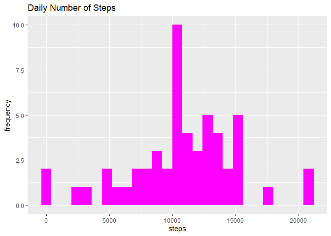
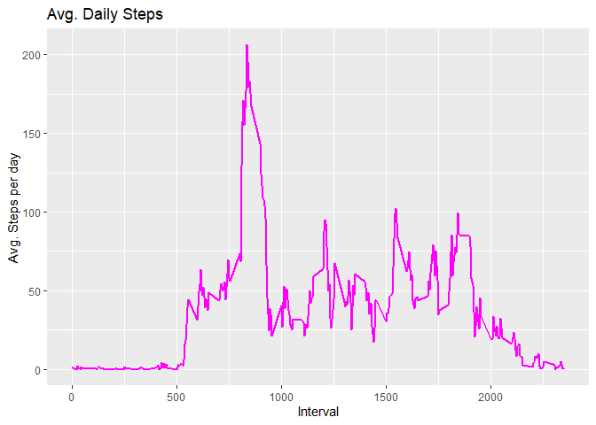
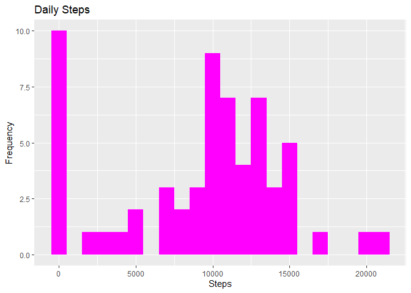

# Data Science Coursera Specialization

## Introduction

In today’s world, we have the capability to collect vast amounts of data
related to personal activities using devices like Fitbit, Nike Fuelband,
or Jawbone Up. These devices are integral to the “quantified self”
movement, where individuals regularly gather data about themselves to
improve their health, identify behavioral patterns, or simply indulge
their curiosity as tech enthusiasts. Despite the abundance of data,
there are challenges in acquiring raw data and a scarcity of statistical
methods and software for effectively processing and interpreting this
data.

This assignment focuses on utilizing data from a personal activity
monitoring device that records data at 5-minute intervals throughout the
day. The dataset spans two months, covering October and November 2012,
and it contains information about the number of steps taken in 5-minute
intervals on each day.

The dataset for this assignment can be downloaded from the course
website:

-   **Dataset**: [Activity Monitoring
    Data](https://d396qusza40orc.cloudfront.net/repdata%2Fdata%2Factivity.zip)

The dataset consists of the following variables:

-   **steps**: The number of steps taken in a 5-minute interval (missing
    values are denoted as 𝙽𝙰).
-   **date**: The date on which the measurement was taken in YYYY-MM-DD
    format.
-   **interval**: An identifier for the 5-minute interval during which
    the measurement was recorded.

The dataset is stored in a comma-separated-value (CSV) file and
comprises a total of 17,568 observations.

## Loading and preprocessing the data

### Unzip the data to get the CSV data file

``` r
library(data.table)
library(ggplot2)

dataURL <- "https://d396qusza40orc.cloudfront.net/repdata%2Fdata%2Factivity.zip"
download.file(url = dataURL,destfile = paste0(getwd(), '/repdata%2Fdata%2Factivity.zip'), method = "curl")
unzip("repdata%2Fdata%2Factivity.zip",exdir = "data")
```

### Reading csv Data into Data.Table.

``` r
activity <- data.table::fread(input = "data/activity.csv")
```

## What is mean total number of steps taken per day?

### The total number of steps taken per day

``` r
Total_Steps <- activity[, c(lapply(.SD, sum, na.rm = FALSE)), .SDcols = c("steps"), by = .(date)] 

head(Total_Steps, 10)
```

    ##           date steps
    ##  1: 2012-10-01    NA
    ##  2: 2012-10-02   126
    ##  3: 2012-10-03 11352
    ##  4: 2012-10-04 12116
    ##  5: 2012-10-05 13294
    ##  6: 2012-10-06 15420
    ##  7: 2012-10-07 11015
    ##  8: 2012-10-08    NA
    ##  9: 2012-10-09 12811
    ## 10: 2012-10-10  9900

### histogram of the total number of steps taken each day

``` r
ggplot(Total_Steps, aes(x = steps))+
    geom_histogram(fill = "magenta", binwidth = 800)+
    labs(title = "Daily Number of Steps", x = "steps", y = "frequency")
```

    ## Warning: Removed 8 rows containing non-finite values (stat_bin).


\### The Report including the mean and the median number of step taken
each day

``` r
Total_Steps[, .(Mean_Steps = mean(steps, na.rm = TRUE), Median_Steps = median(steps, na.rm = TRUE))]
```

    ##    Mean_Steps Median_Steps
    ## 1:   10766.19        10765

## What is the average daily activity pattern?

### Time series plot of the average number of steps taken across all days

``` r
IntervalDT <- activity[, c(lapply(.SD, mean, na.rm = TRUE)), .SDcols = c("steps"), by = .(interval)] 

ggplot(IntervalDT, aes(x = interval , y = steps)) + geom_line(color="magenta", size=1) + labs(title = "Avg. Daily Steps", x = "Interval", y = "Avg. Steps per day")
```


\### Which 5-minute interval, on average across all the days in the
dataset, contains the maximum number of steps?

``` r
IntervalDT[steps == max(steps), .(max_interval = interval)]
```

    ##    max_interval
    ## 1:          835

## Imputing missing values

### The total number of missing values in the dataset

``` r
activity[is.na(steps), .N ]
```

    ## [1] 2304

### Filling in all of the missing values in the dataset

``` r
# Filling in missing values with median of dataset. 
activity[is.na(steps), "steps"] <- activity[, c(lapply(.SD, median, na.rm = TRUE)), .SDcols = c("steps")]
```

### A new dataset that is equal to the original dataset but with the missing data filled in

``` r
data.table::fwrite(x = activity, file = "data/tidyData.csv", quote = FALSE)
```

### A histogram of the total number of steps taken each day and calculate and report the mean and median total number of steps taken per day. Do these values differ from the estimates from the first part of the assignment? What is the impact of imputing missing data on the estimates of the total daily number of steps?

``` r
# total number of steps taken per day
Total_Steps <- activity[, c(lapply(.SD, sum)), .SDcols = c("steps"), by = .(date)] 

# mean and median total number of steps taken per day
Total_Steps[, .(Mean_Steps = mean(steps), Median_Steps = median(steps))]
```

    ##    Mean_Steps Median_Steps
    ## 1:    9354.23        10395

``` r
ggplot(Total_Steps, aes(x = steps)) + geom_histogram(fill = "magenta", binwidth = 1000) + labs(title = "Daily Steps", x = "Steps", y = "Frequency")
```


\## Are there differences in activity patterns between weekdays and
weekends? \### Create a new factor variable in the dataset with two
levels – “weekday” and “weekend” indicating whether a given date is a
weekday or weekend day.

``` r
# Just recreating activity from scratch then making the new factor variable. (No need to, just want to be clear on what the entire process is.) 
activity <- data.table::fread(input = "data/activity.csv")
activity[, date := as.POSIXct(date, format = "%Y-%m-%d")]
activity[, `Day of Week`:= weekdays(x = date)]
activity[grepl(pattern = "Monday|Tuesday|Wednesday|Thursday|Friday", x = `Day of Week`), "weekday or weekend"] <- "weekday"
activity[grepl(pattern = "Saturday|Sunday", x = `Day of Week`), "weekday or weekend"] <- "weekend"
activity[, `weekday or weekend` := as.factor(`weekday or weekend`)]
head(activity, 10)
```

    ##     steps       date interval Day of Week weekday or weekend
    ##  1:    NA 2012-10-01        0      Monday            weekday
    ##  2:    NA 2012-10-01        5      Monday            weekday
    ##  3:    NA 2012-10-01       10      Monday            weekday
    ##  4:    NA 2012-10-01       15      Monday            weekday
    ##  5:    NA 2012-10-01       20      Monday            weekday
    ##  6:    NA 2012-10-01       25      Monday            weekday
    ##  7:    NA 2012-10-01       30      Monday            weekday
    ##  8:    NA 2012-10-01       35      Monday            weekday
    ##  9:    NA 2012-10-01       40      Monday            weekday
    ## 10:    NA 2012-10-01       45      Monday            weekday

### A panel plot containing a time series plot of the 5-minute interval and the average number of steps taken, averaged across all weekday days or weekend days .

``` r
activity[is.na(steps), "steps"] <- activity[, c(lapply(.SD, median, na.rm = TRUE)), .SDcols = c("steps")]
Interval <- activity[, c(lapply(.SD, mean, na.rm = TRUE)), .SDcols = c("steps"), by = .(interval, `weekday or weekend`)] 

ggplot(Interval , aes(x = interval , y = steps, color=`weekday or weekend`)) + geom_line() + labs(title = "Avg. Daily Steps by Weektype", x = "Interval", y = "No. of Steps") + facet_wrap(~`weekday or weekend` , ncol = 1, nrow=2)
```


